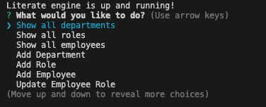

# Literate Engine
Literate Engine is a productivity cms that allows organization among the work place through the command line. Query add or update members of your workforce.

## How It Works

1. git clone this repository
2. npm install
3. make a dotenv with your mysql db login.
4. npm start

The server.js file seeds the database with the mock data provided in this tutorial and in the repo.

### Demo
Check out this clip on how it works

